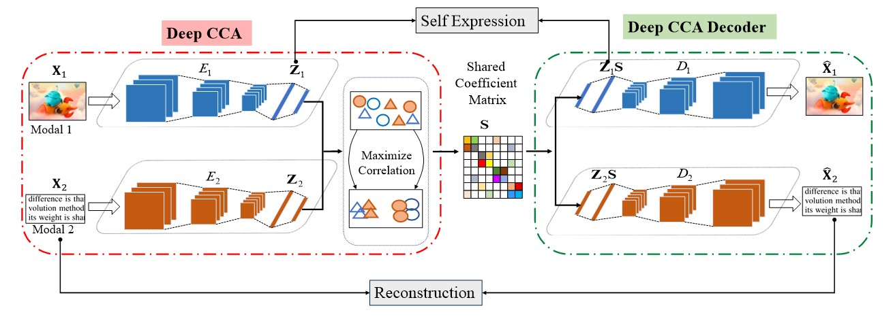
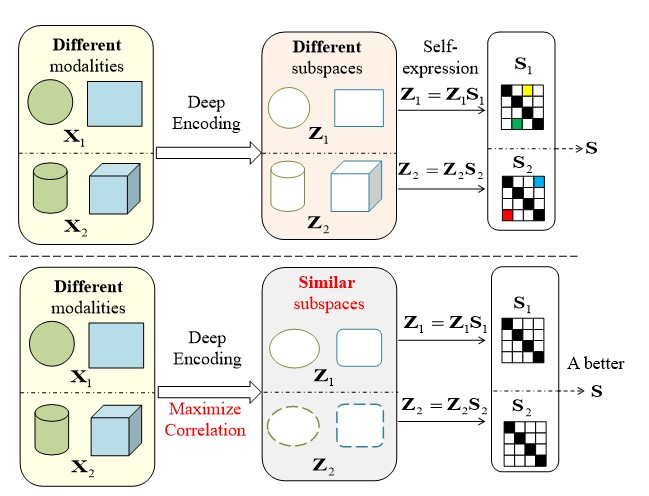

#CMSC-DCCA：Cross-Modal Subspace Clustering via Deep Canonical Correlation Analysis#

###Quanxue Gao, Huanhuan Lian, Qianqian Wang, Gan Sun: Cross-Modal Subspace Clustering via Deep Canonical Correlation Analysis, AAAI, 2020: 3938-3945.###

[Paper Link](https://ojs.aaai.org/index.php/AAAI/article/view/5808)


**Bibtex**  

@inproceedings{gao2020cross,  
  title={Cross-Modal Subspace Clustering via Deep Canonical Correlation Analysis.},  
  author={Gao, Quanxue and Lian, Huanhuan and Wang, Qianqian and Sun, Gan},  
  booktitle={AAAI},  
  pages={3938--3945},  
  year={2020}  
}  

**CMSC-DCCA Model:**  

<div style="text-align: center; width: 900px; border: green solid 1px;">

<br></br>
<center></center>
</div>


**Introduction:**  

For cross-modal subspace clustering, the key point is how to exploit the correlation information between cross-modal data. However, most hierarchical and structural correlation information among cross-modal data cannot be well exploited due to its high-dimensional non-linear property. To tackle this problem, in this paper, we propose an unsupervised framework named Cross-Modal Subspace Clustering via Deep Canonical Correlation Analysis (CMSC-DCCA), which incorporates the correlation constraint with a self-expressive layer to make full use of information among the inter-modal data and the intra-modal data. More specifically, the proposed model consists of three components: 1) deep canonical correlation analysis (Deep CCA) model; 2) self-expressive layer; 3) Deep CCA decoders. The Deep CCA model consists of convolutional encoders and correlation constraint. Convolutional encoders are used to obtain the latent representations of cross-modal data, while adding the correlation constraint for the latent representations can make full use of the information of the inter-modal data. Furthermore, self-expressive layer works on latent representations and constrain it perform self-expression properties, which makes the shared coefficient matrix could capture the hierarchical intra-modal correlations of each modality. Then Deep CCA decoders reconstruct data to ensure that the encoded features can preserve the structure of the original data. Experimental results on several real-world datasets demonstrate the proposed method outperforms the state-of-the-art methods.

<div style="text-align: center; width: 900px; border: green solid 1px;">

<br></br>
<center></center>
</div>

**Datasets:**  

The used datasets in our experiments include: 1) FRGC Dataset is an RGB image dataset. In our work, we randomly select 20 objects from the original dataset including 2,462 face images. We set the data size to 32 \times32, using its original RGB images as the first modality and its corresponding gray images as the second modality; 2) Fashion-MNIST Dataset is an image dataset which contains 10 categories with a total of 70,000 different products: t-shirt, shirt, coat, pullover, dress, trouser, bag, sandal, sneaker, ankle boot. The size of each image is 28 \times28. In our work, we randomly select 200 samples from per category to make the network easy to handle, and extract their edge features as the second modality; 3) YTF Dataset is a face videos dataset which includes 3,425 videos of 1,595 different people. In our work, we select 41 subjects from YTF dataset, and set the size as 55 \times55. We use its original RGB images as the first modality, and the gray pictures converted from the original RGB images as the second modality; 4) COIL-20 Dataset consists of 1440 images from 20 objects, and each object includes 72 images that one image is captured for every 5 degrees. In this paper, we use 1440 images and extract their edge features. The 1440 original images and the edge feature images are used as two modalities data.

**Requirements**  

Python 3.6  
PyTorch 1.0  
**Train the model**   
```
python train.py
```

